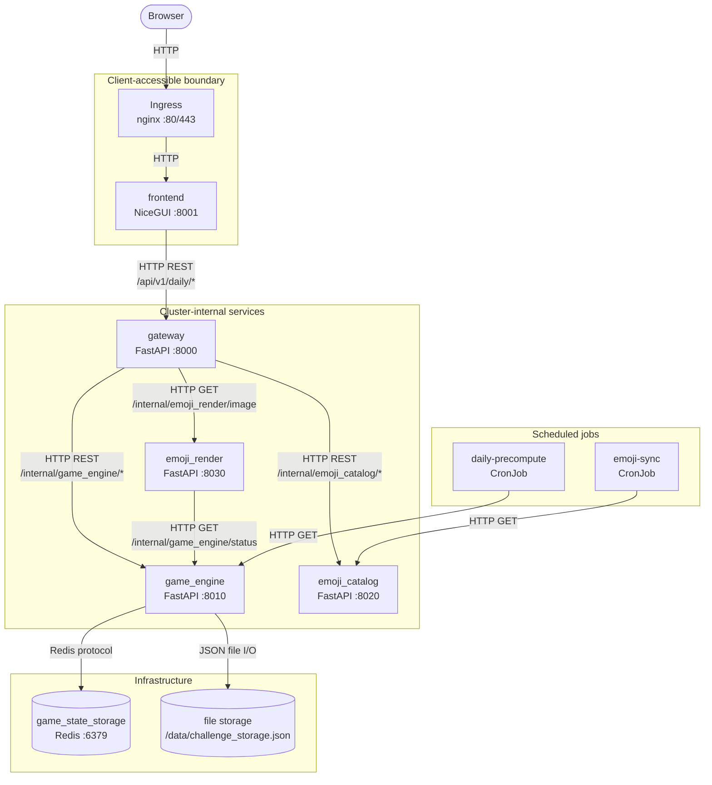
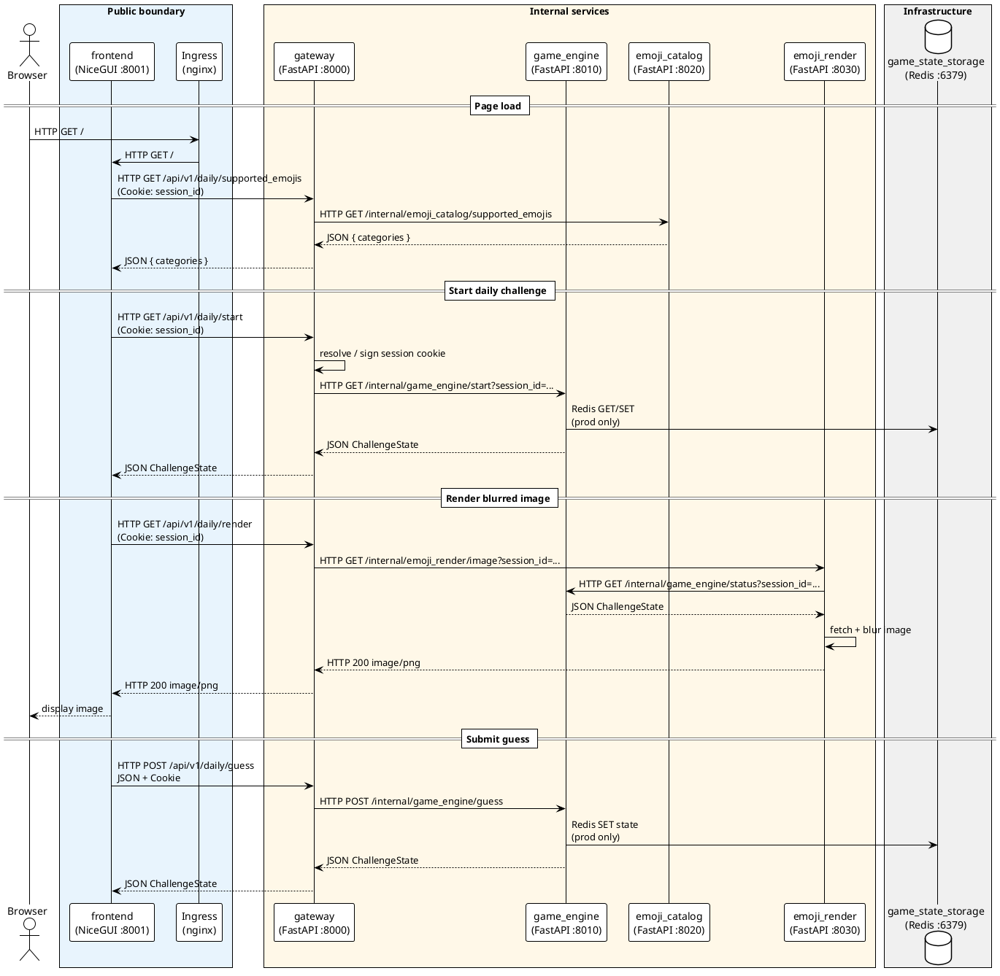

# Blurmoji

Blurmoji is a daily emoji guessing game. Each wrong guess progressively reveals more detail in the challenge image until the player solves the puzzle or runs out of attempts.

See Google Lab progress :


## Gameplay demo
Feature demo + winning :


Losing :


## Quick start – Kubernetes

### 1. Prerequisites

| Tool                                                          | Purpose                             |
|---------------------------------------------------------------|-------------------------------------|
| [Docker](https://docs.docker.com/get-docker/)                 | Build the application image         |
| [minikube](https://minikube.sigs.k8s.io/docs/start/)          | Local Kubernetes cluster            |
| [kubectl](https://kubernetes.io/docs/tasks/tools/)            | Inspect and manage workloads        |
| [Helm](https://helm.sh/docs/intro/install/) 3.x               | Chart templating (used by helmfile) |
| [helmfile](https://github.com/helmfile/helmfile#installation) | Environment-based deployments       |

For running services locally (without Kubernetes):

| Tool        | Purpose                    |
|-------------|----------------------------|
| Python 3.12 | Application runtime        |
| pip         | Install `requirements.txt` |

### 2. Start minikube

```powershell
minikube start
minikube status          # apiserver must be Running, kubeconfig Configured
kubectl cluster-info
minikube addons enable ingress
```

### 3. Build and load the image

```powershell
docker build -t blurmoji:1.0 .
minikube image load blurmoji:1.0
```

Rebuild and reload after every code change before redeploying.

### 4. Deploy with Helmfile

Helm values dictate environments.
| Environment | Command                            | Config source                      | Storage        |
|-------------|------------------------------------|------------------------------------|----------------|
| **dev**     | `helmfile --environment dev sync`  | `values.yaml` + `values.dev.yaml`  | File           |
| **prod**    | `helmfile --environment prod sync` | `values.yaml` + `values.prod.yaml` | Redis + Secret |

```powershell
helmfile --environment dev sync
# or
helmfile --environment prod sync
```

### 5. Accessing the app

In a new terminal, start the tunnel and keep it open:
```powershell
minikube tunnel
```

Fetch host with:
```powershell
kubectl get ingress -n blurmoji
```

Then open in your browser. It is **http://localhost** by default with local `minikube`.

### 6. Clean up

Remove the release and namespace:

```powershell
helmfile --environment dev destroy
# or
helmfile --environment prod destroy
```

---

## Quick start - local run

Equivalent to the **dev** Helm environment. Configuration comes from `.env` (same values as `values.dev.yaml`, but with `localhost` URLs).

```powershell
python -m venv .venv
.venv\Scripts\Activate.ps1
pip install -r requirements.txt
cp .env.example .env    # optional — .env is already provided
```

Start each service in a separate terminal:

```powershell
python -m src.services.emoji_catalog.main

# wait for warmup if first run, before executing the rest
python -m src.services.emoji_render.main
python -m src.services.gateway.main
python -m src.services.game_engine.main
python -m src.frontend.main
```

| Service     | URL                   |
|-------------|-----------------------|
| Frontend    | http://localhost:8001 |
| Gateway API | http://localhost:8000 |

---

## Configuration model

There is a single configuration path: **each service reads only the env vars it needs** from the process environment. `.env` is loaded automatically for local runs.

| Where you run                     | Type            | Source             |
|-----------------------------------|-----------------|--------------------|
| `python -m ...` on host           | Local .Env File | `.env`             |
| `helmfile --environment dev ...`  | Helm Value File | `values.dev.yaml`  |
| `helmfile --environment prod ...` | Helm Value File | `values.prod.yaml` |

Ports, timeouts, game rules, and Redis DB/TTL are hardcoded in `src/config/constants.py` and are not env vars.

---

## Architecture overview



### Components

| Component            | Role                                                       | Scope             | Protocol                | K8s resource                         |
|----------------------|------------------------------------------------------------|-------------------|-------------------------|--------------------------------------|
| `frontend`           | NiceGUI UI, session view state                             | External          | HTTP (WebSocket for UI) | Deployment, Service, Ingress backend |
| `gateway`            | Public REST API, signed session cookies, request routing   | Internal/External | HTTP REST               | Deployment, Service                  |
| `game_engine`        | Daily challenge logic, guess processing, state persistence | Internal          | HTTP REST               | Deployment, Service                  |
| `emoji_catalog`      | Emoji Kitchen metadata, grouped keyboard payload           | Internal          | HTTP REST               | Deployment, Service                  |
| `emoji_render`       | Image fetch, progressive blur, PNG response                | Internal          | HTTP (PNG body)         | Deployment, Service                  |
| `game_state_storage` | Shared challenge state (prod)                              | Internal          | Redis protocol          | Deployment, Service                  |
| file storage         | Ephemeral challenge state (dev)                            | Internal          | File I/O                | `emptyDir` on `game_engine`          |
| `daily-precompute`   | Warms daily challenge path                                 | Internal          | HTTP GET via curl       | CronJob                              |
| `emoji-sync`         | Validates catalog availability                             | Internal          | HTTP GET via curl       | CronJob                              |
| Ingress              | Routes root `/` to frontend                                | Public edge       | HTTP / HTTPS            | Ingress                              |

### Accessibility boundary

| Accessible from browser | Internal only                                                                   |
|-------------------------|---------------------------------------------------------------------------------|
| `frontend` via Ingress  | `gateway`, `game_engine`, `emoji_catalog`, `emoji_render`, `game_state_storage` |

---

## Request sequence (PlantUML)



---

## Public API

| Method | Path                             | Description                           |
|--------|----------------------------------|---------------------------------------|
| `GET`  | `/api/v1/daily/start`            | Start or resume daily challenge       |
| `POST` | `/api/v1/daily/guess`            | Submit emoji couple guess             |
| `GET`  | `/api/v1/daily/get_status`       | Current challenge state               |
| `GET`  | `/api/v1/daily/render`           | Blurred or full challenge image (PNG) |
| `GET`  | `/api/v1/daily/supported_emojis` | Grouped emoji keyboard metadata       |

---

## Cron workloads

| CronJob            | Schedule       | Target                                                     |
|--------------------|----------------|------------------------------------------------------------|
| `daily-precompute` | `0 0 * * *`    | `game_engine` `/internal/game_engine/start`                |
| `emoji-sync`       | `0 */12 * * *` | `emoji_catalog` `/internal/emoji_catalog/supported_emojis` |

---

## Project layout

```
Blurmoji root project
├── .env.example                 # .env guideline to be duplicated as .env for local runs
├── helmfile.yaml.gotmpl         # Entrypoint to deploy in dev or prod
├── Dockerfile
├── requirements.txt
├── chart/blurmoji/
│   ├── values.yaml              # Shared defaults
│   ├── values.dev.yaml          # File storage, single replicas
│   ├── values.prod.yaml         # Redis, secrets, higher replicas
│   └── templates/               # K8s manifests 
└── src/
    ├── config/
    │   ├── constants.py         # Ports, timeouts, game rules
    │   ├── settings.py          # Config dataclasses
    │   └── loader.py            # Per-service env var loaders
    ├── core/                    # Domain logic
    ├── frontend/
    ├── persistence/
    ├── services/
    │   ├── gateway/
    │   ├── game_engine/
    │   ├── emoji_catalog/
    │   └── emoji_render/
    └── utils/
```
