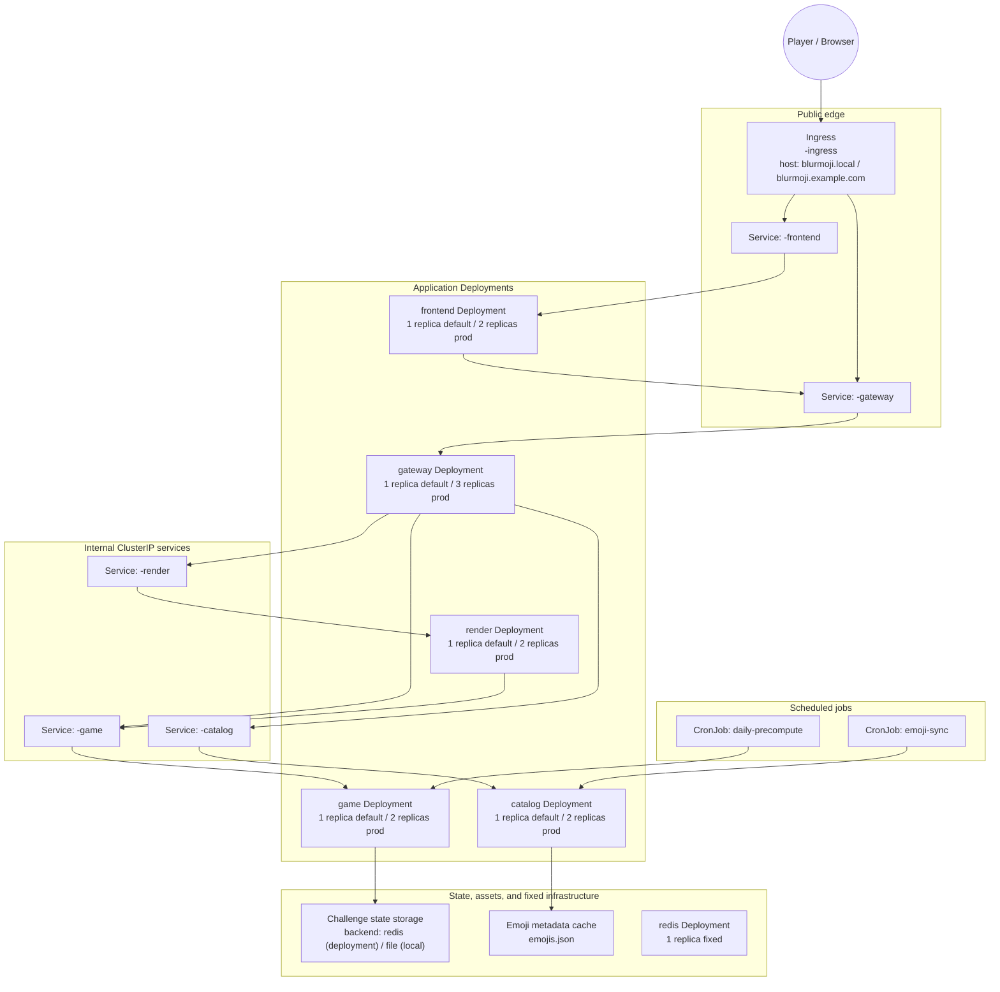

# Blurmoji

Blurmoji is an emoji guessing game where each wrong guess progressively reveals more image detail until the player solves the daily challenge.

## Gameplay behavior
- Daily challenge with a fixed max attempts count
- Session-scoped progression keyed by `session_id` cookie
- `/render` returns blurred or full image depending on current game state
- Emoji picker is driven by grouped Emoji Kitchen metadata

## Deployed architecture

This is the Helm/Kubernetes deployment shipped by `chart/blurmoji`. Kubernetes `Service` objects route traffic; the horizontally scaled units are the `Deployment` pods behind them. Scaling is static through Helm values, not through an HPA.

### Mermaid deployment diagram



### Retrospective scaling model

| Component | Kubernetes kind | Default replicas (`values.yaml`) | Production replicas (`values.prod.yaml`) | Scaling mode |
| --- | --- | ---: | ---: | --- |
| `gateway` | Deployment | 1 | 3 | horizontally scaled stateless app tier |
| `game` | Deployment | 1 | 2 | horizontally scaled stateless app tier |
| `catalog` | Deployment | 1 | 2 | horizontally scaled stateless app tier |
| `render` | Deployment | 1 | 2 | horizontally scaled stateless app tier |
| `frontend` | Deployment | 1 | 2 | horizontally scaled UI tier |
| `redis` | Deployment | 1 | 1 | fixed singleton support service |
| `Ingress`, `Service`, `ConfigMap`, `Secret`, `CronJob` | control/routing/storage objects | n/a | n/a | not horizontally scaled |

Notes:
- The chart has no HPA/KEDA; replica counts are static Helm values.
- `Service` objects provide stable DNS/port routing only.
- Configuration is split by concern: runtime settings in `*-runtime-config`, storage backend settings in `*-storage-config`, and secrets in `*-secret`.
- Deployment challenge state uses Redis (`CHALLENGE_STORAGE_BACKEND=redis`); file-backed state (`CHALLENGE_STORAGE_BACKEND=file`) is retained for local testing.

## Why this deployment is shaped this way

### Stateless app tiers scale horizontally
- `gateway`, `game`, `catalog`, `render`, and `frontend` are independent Deployments.
- Default chart replicas are `1`; production override raises them to `3/2/2/2/2`.
- There is no HPA, so the replica count is intentionally explicit in Helm values.

### Fixed infrastructure stays singleton
- `redis` stays at `1` replica in the current chart.

### Runtime config is split by concern
- `*-runtime-config` carries service URLs, ports, and timeouts.
- `*-storage-config` carries `CHALLENGE_STORAGE_BACKEND` and backend-specific settings.
- `*-secret` carries sensitive values.

### Storage backend is explicit by environment
- Local/dev can use file storage by setting `CHALLENGE_STORAGE_BACKEND=file`.
- Deployment/prod uses Redis by setting `CHALLENGE_STORAGE_BACKEND=redis` plus `REDIS_*` values.

## Environment variables

Use `.env.example` as the reference source of required runtime variables.

Core groups:
- Gateway edge: `API_HOST`, `API_PORT`, `SESSION_COOKIE_SECRET`
- Internal services: `GAME_SERVICE_*`, `CATALOG_SERVICE_*`, `RENDER_SERVICE_*`
- Service discovery: `*_BASE_URL`, `INTERNAL_HTTP_TIMEOUT_SECONDS`
- Frontend: `API_BASE_URL`, `FRONTEND_HOST`, `FRONTEND_PORT`
- Challenge storage: `CHALLENGE_STORAGE_BACKEND`, `REDIS_HOST`, `REDIS_PORT`, `REDIS_DB`, `REDIS_TTL_SECONDS`

## Helmfile deployment

Helmfile is the default workflow.

```powershell
helmfile --environment dev sync
```

Production deployment:

```powershell
helmfile --environment prod sync
```

If you need to render the chart directly:

```powershell
helm template blurmoji chart/blurmoji -f chart/blurmoji/values.yaml
```

Helm chart path: `chart/blurmoji`

Helmfile state file: `helmfile.yaml.gotmpl`

The deployment diagram and scaling table above reflect the chart’s static replica model. Edit `chart/blurmoji/values.yaml` for shared defaults and `chart/blurmoji/values.prod.yaml` for production-only overrides.

## Run locally (multi-process)

1) Install dependencies.
2) Configure `.env` from `.env.example`.
3) Start each service in a separate terminal.

```powershell
python -m src.services.game.main
python -m src.services.emoji_catalog.main
python -m src.services.render.main
python -m src.services.gateway.main
python -m src.frontend.main
```

Gateway URL: `http://localhost:8000`  
Frontend URL: `http://localhost:8001`


## Smoke tests in isolated pods

Each smoke scenario can run in its own pod/job using manifests in `src/deploy/k8s/tests`.

Build the test image:

```powershell
docker build -t blurmoji/tests:latest .
```

Apply isolated test jobs:

```powershell
kubectl apply -f src/deploy/k8s/tests/configmap.yaml
kubectl apply -f src/deploy/k8s/tests/job-queue-delay.yaml
kubectl apply -f src/deploy/k8s/tests/job-concurrent-sessions.yaml
kubectl apply -f src/deploy/k8s/tests/job-gateway-restrictions.yaml
kubectl apply -f src/deploy/k8s/tests/job-stress.yaml
kubectl apply -f src/deploy/k8s/tests/job-connectivity.yaml
```

## Cron workloads included
- Daily precompute cron: warms daily challenge path by calling `game-service`
- Emoji sync cron: refreshes/validates catalog path by calling `emoji-catalog-service`

## API contract (public)
- `GET /api/v1/daily/start`
- `POST /api/v1/daily/guess`
- `GET /api/v1/daily/get_status`
- `GET /api/v1/daily/render`
- `GET /api/v1/daily/supported_emojis`

Payload conventions are preserved:
- `keyboardPosition` for emoji payload entries
- `resultImageUrl` for emoji combination assets
